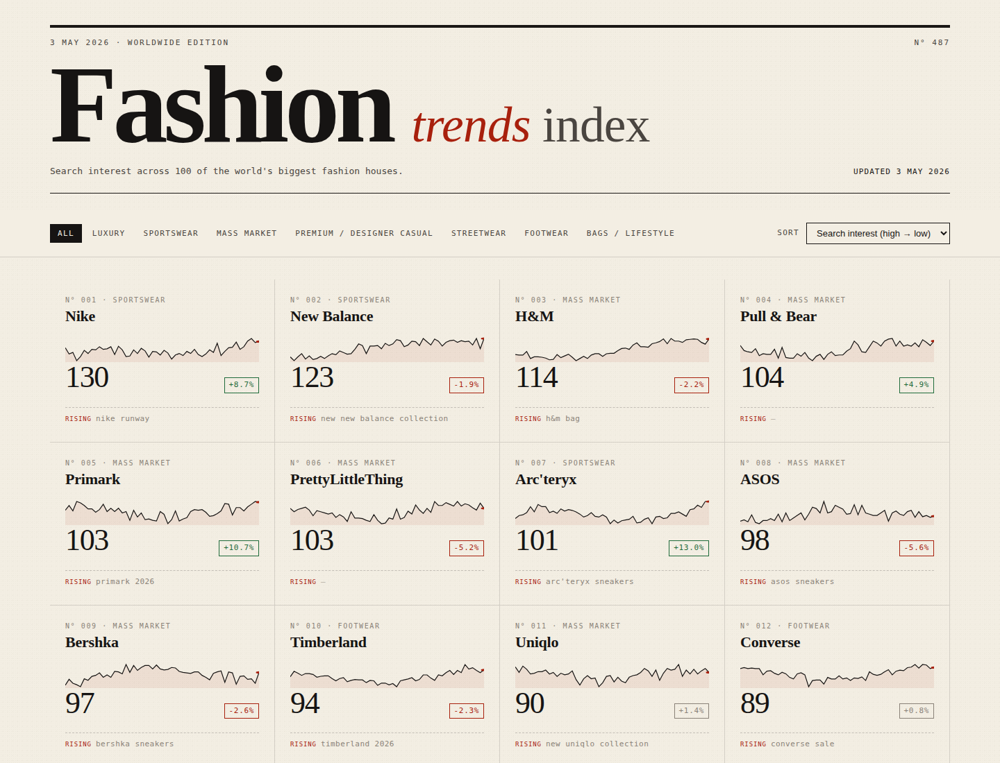

# Fashion Trends Dashboard

A daily-refreshed dashboard tracking Google Trends search interest for 100 of the world's biggest fashion brands. Runs entirely on free GitHub infrastructure.



## What this is

- **Data layer**: a Python script (`scripts/fetch_trends.py`) that pulls 12 months of search interest + rising queries from Google Trends for 100 fashion brands and writes a single JSON file.
- **Schedule**: a GitHub Actions workflow (`.github/workflows/update.yml`) that runs the script every morning and commits the refreshed data back to the repo.
- **Dashboard**: a static HTML/CSS/JS page (`docs/`) styled like a fashion magazine, served free via GitHub Pages.

No backend, no database, no paid services.

## Refresh schedule

The cron runs at **06:00 UTC** daily. That puts fresh data live by:

- **08:00 Amsterdam** in summer (CEST = UTC+2) ✓
- **07:00 Amsterdam** in winter (CET = UTC+1) — one hour earlier than asked

GitHub Actions cron does **not** auto-adjust for daylight saving. If you want exactly 08:00 Amsterdam year-round, uncomment the second cron line in the workflow file (it will run twice a day across the DST switch — harmless, the script is idempotent).

## Setup (one-time, ~10 minutes)

### 1. Create a GitHub repo

1. Create a new **public** repo on GitHub (public is required for the free GitHub Pages tier; private works too if you have GitHub Pro).
2. Upload the contents of this folder, or push from your local machine:

   ```bash
   git init
   git add .
   git commit -m "initial commit"
   git remote add origin https://github.com/YOUR-USERNAME/YOUR-REPO.git
   git push -u origin main
   ```

### 2. Enable GitHub Pages

1. Go to your repo on GitHub → **Settings** → **Pages**.
2. Under **Source**, select **Deploy from a branch**.
3. Set **Branch** to `main` and **Folder** to `/docs`.
4. Click **Save**.
5. After ~1 minute, your dashboard will be live at:
   `https://YOUR-USERNAME.github.io/YOUR-REPO/`

### 3. Allow the workflow to commit data

1. Go to **Settings** → **Actions** → **General**.
2. Scroll to **Workflow permissions**.
3. Select **Read and write permissions**.
4. Click **Save**.

### 4. Run the workflow once (optional)

The cron will fire automatically at 06:00 UTC. To populate the dashboard immediately:

1. Go to the **Actions** tab.
2. Pick **Update fashion trends** on the left.
3. Click **Run workflow** → **Run workflow**.

The first run takes ~15–20 minutes (rate-limited Google Trends requests).

## Local development

```bash
pip install -r requirements.txt

# Fetch fresh data into docs/data/trends.json
python scripts/fetch_trends.py

# Preview the dashboard
python -m http.server 8000 --directory docs
# open http://localhost:8000
```

## Customisation

### Change the brand list
Edit `brands.json`. Brands are grouped by category — categories appear as filter tabs in the dashboard automatically. Keep the total around 100 to stay within sensible Google Trends rate limits; much more and the workflow will slow down considerably.

### Change the timeframe
In `scripts/fetch_trends.py`, edit `TIMEFRAME`. Common values: `"today 12-m"` (12 months), `"today 3-m"` (3 months), `"today 5-y"` (5 years).

### Change geography
Edit `GEO` in `scripts/fetch_trends.py`. Empty string `""` is worldwide. Use ISO codes like `"US"`, `"NL"`, `"GB"`. You can also do per-country (e.g., `"US-NY"`).

### Change the benchmark
Nike is currently the cross-batch benchmark (every batch of 5 brands includes Nike, and other brands are normalised against Nike's level). Pick something universally well-searched if you change it — Zara also works well.

## Known limitations

- **No official Google Trends API exists.** This uses the unofficial `pytrends` library, which scrapes the public Trends site. Google occasionally changes the site, which can break pytrends; you may need to update the `pytrends` version in `requirements.txt` from time to time.
- **Rate limits.** 100 brands is at the higher end of what's reliable. If you see lots of empty series in the data, increase `BATCH_DELAY` in the script (e.g. from 8 to 15 seconds) or reduce the brand count.
- **Magnitude is relative, not absolute.** Search interest is rescaled vs. the benchmark. A brand showing "60" doesn't mean 60 searches per minute — it means roughly 60% of the benchmark's level over the period.

## File structure

```
.
├── README.md
├── brands.json                     # the 100 brands, grouped
├── requirements.txt                # python deps
├── scripts/
│   └── fetch_trends.py             # daily fetch script
├── .github/workflows/
│   └── update.yml                  # cron + commit
└── docs/                           # served by GitHub Pages
    ├── index.html
    ├── style.css
    ├── app.js
    └── data/
        └── trends.json             # refreshed daily
```

## License

Use freely. Google Trends data belongs to Google; check their terms before using this commercially.
